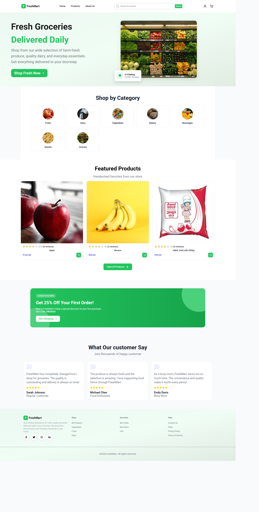
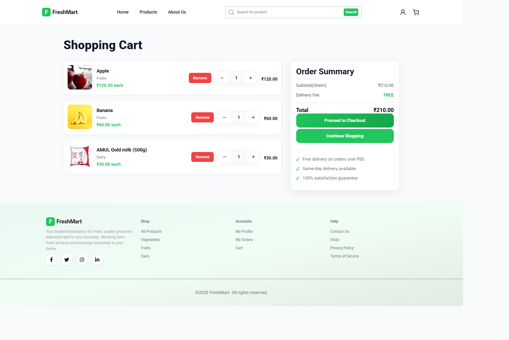
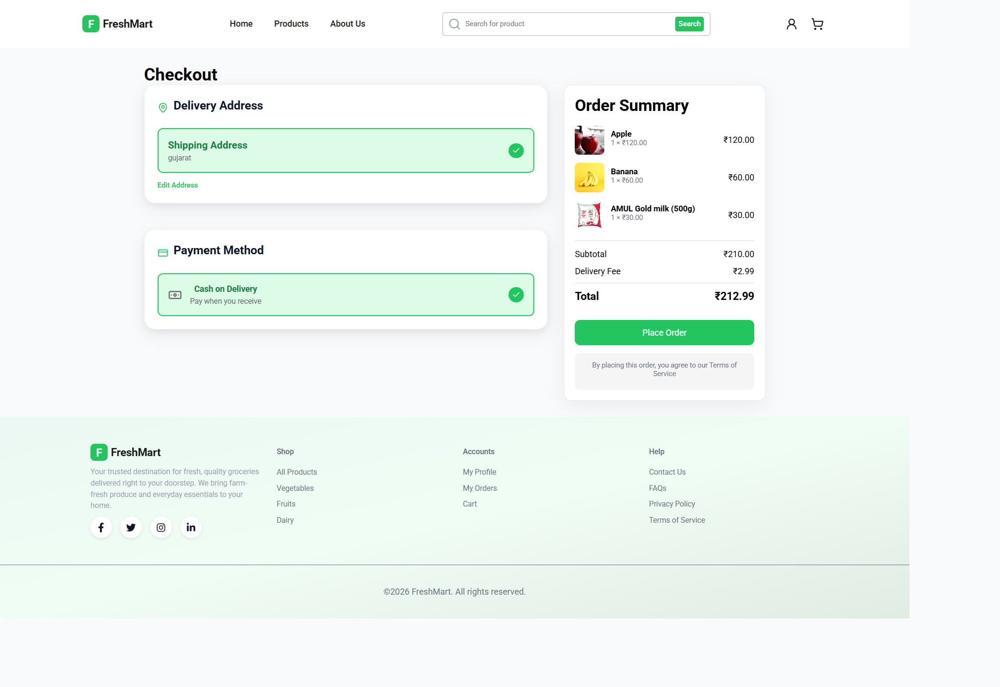
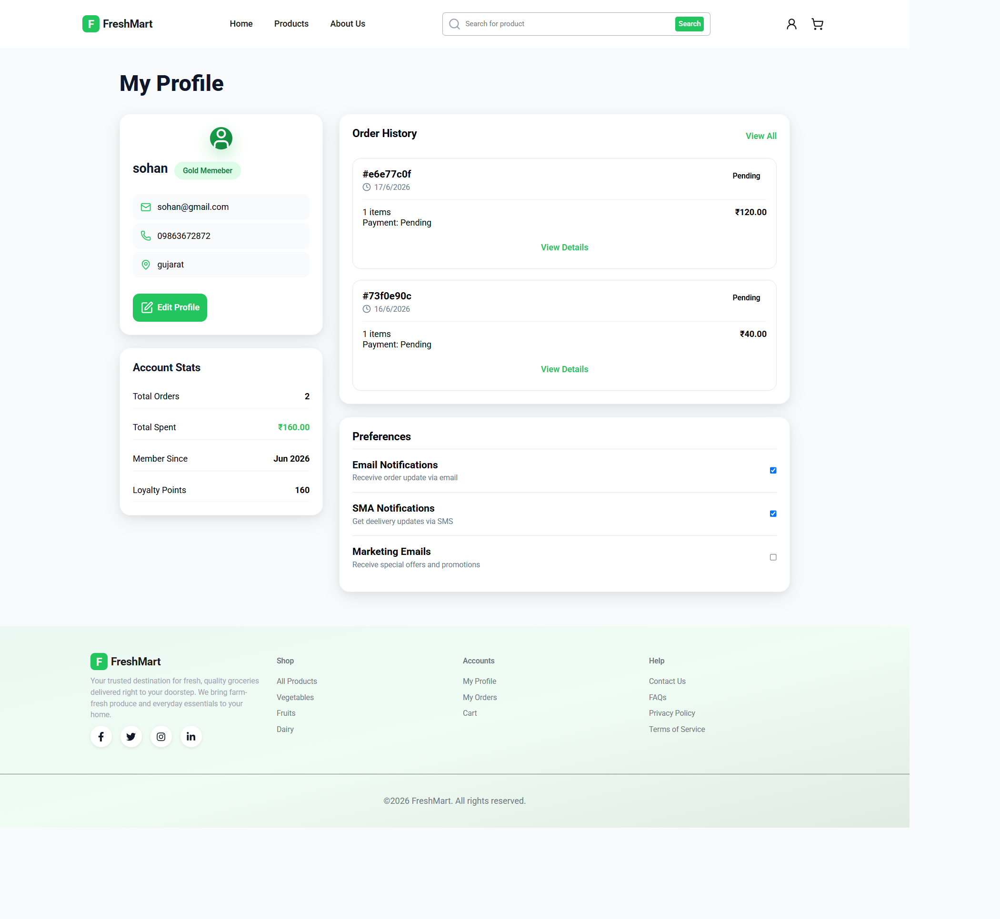
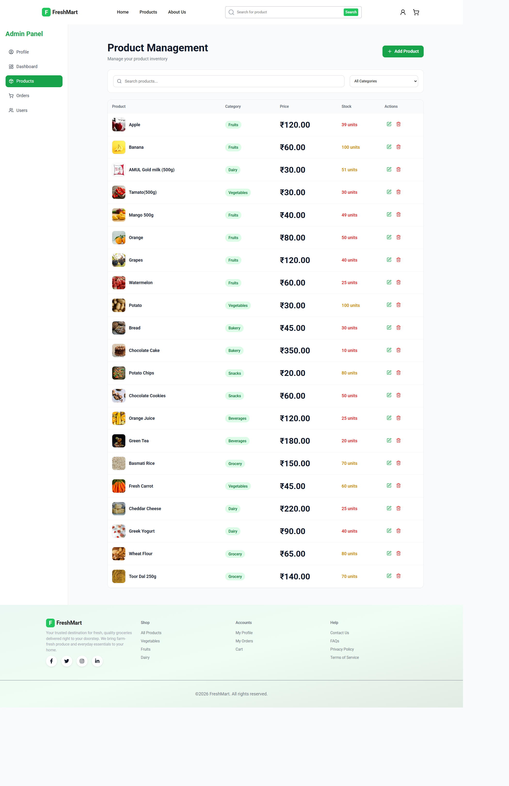
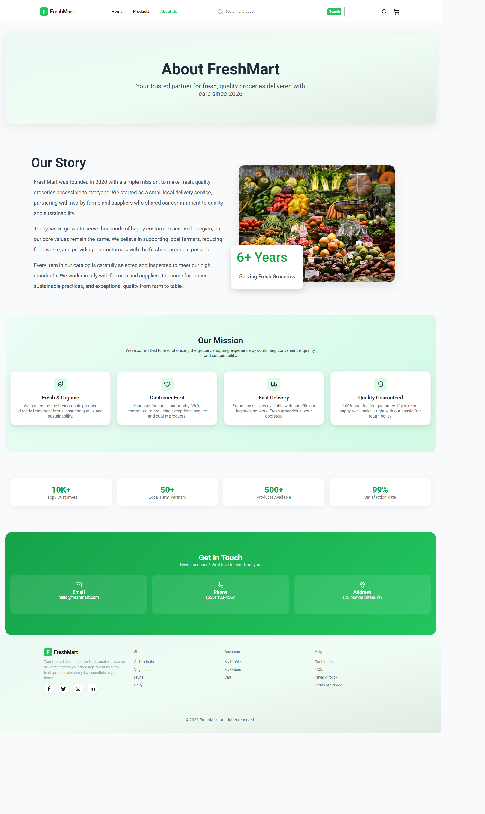

# 🛒 FreshMart - MERN Grocery Store

A full-stack grocery e-commerce web application built using the MERN Stack. FreshMart allows customers to browse products, manage their cart, place orders, and track order history, while administrators can manage products, users, categories, and orders through a dedicated dashboard.

---

## 🚀 Features

### 👤 User Features

* User Registration & Login (JWT Authentication)
* Browse Products by Category
* Product Search & Filtering
* Product Details Page
* Add to Cart
* Update Cart Quantity
* Cash on Delivery (COD)
* Place Orders
* Order History
* Product Ratings & Reviews
* User Profile Management
* Responsive UI

---

### 👨‍💼 Admin Features

* Secure Admin Dashboard
* Add, Edit & Delete Products
* Manage Categories
* Manage Orders
* Update Order Status
* Manage Users
* Dashboard Statistics
* Product Inventory Management

---

## 🛠️ Tech Stack

### Frontend

* React.js
* Vite
* React Router
* Context API
* Axios
* CSS

### Backend

* Node.js
* Express.js
* MongoDB
* Mongoose
* JWT Authentication
* bcrypt.js
* Multer

---

## 📂 Project Structure

```text
FreshMart/
│
├── frontend/
│   ├── src/
│   ├── public/
│   └── package.json
│
├── backend/
│   ├── controllers/
│   ├── middleware/
│   ├── models/
│   ├── routes/
│   ├── Server.js
│   └── package.json
│
└── README.md
```

---

## ⚙️ Installation

### Clone Repository

```bash
git clone https://github.com/rajvarma2001/FreshMart.git
```

### Backend

```bash
cd backend
npm install
npm run dev
```

### Frontend

```bash
cd frontend
npm install
npm run dev
```

---

## 🔐 Environment Variables

Create a `.env` file inside the backend folder.

Example:

```env
PORT=5000
MONGO_URI=your_mongodb_connection_string
JWT_SECRET=your_secret_key
```

---

## 📸 Screenshots

Add screenshots here after deployment.

* Home Page
* Product Listing
* Product Details
* Cart
* Checkout
* Admin Dashboard
* Order Management

---

## 🔮 Future Improvements

* Online Payment Integration
* Wishlist
* Coupons & Discounts
* Email Notifications
* Sales Analytics
* AI Product Recommendations
* Live Order Tracking

---

## 👨‍💻 Author

**Raj Varma**

* MERN Stack Developer
* GitHub: https://github.com/rajvarma2001
* LinkedIn: *(Add your LinkedIn profile URL here)*

---

## ⭐ Support

If you found this project useful, consider giving it a ⭐ on GitHub.


## 📸 Screenshots

| Home Page                              | Product Page                                 |
| -------------------------------------- | -------------------------------------------- |
|  |  |

| Shopping Cart                                  | Checkout                              |
| ---------------------------------------------- | ------------------------------------- |
|  |  |

| Profile                             | Admin Dashboard                                |
| ----------------------------------- | ---------------------------------------------- |
|  |  |

| About                           |
| ------------------------------- |
|  |

